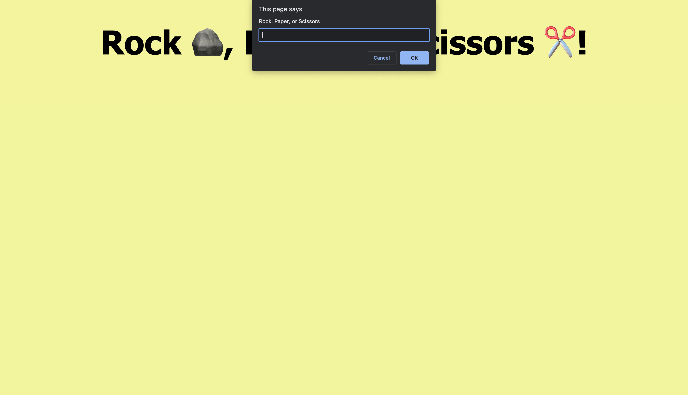

## Rock, Paper, Scissors Game

# Description
This is a website that is designated to showcasing my ability of utilizing javascript to make a fun game that everyone knows and loves!
This will include . . .

1. Allowing users to play Rock, Paper, Scissors against an automatted opponent.

2. Allowing users to enter their choice of Rock, Paper, or Scissors.

3. An automatted oponent choosing from the same list of choices.

4. Allowing users to choose whether to play the game again.

5. Reporting the final score after each game played.

# Table of Contents

* [Project Title](#project-title)
* [Description](#description)
* [Table of Contents](#table-of-contents)
* [Installation](#installation)
* [Usage](#usage)
* [Contributing](#contributing)
* [License](#license)
* [Acknowledgements](#acknowledgements)
* [Support](#support)
* [Version History](#version-history)
*  [References](#references)
*  [Screenshots](#screenshots)
*  [Demo](#demo)

# Installation
In order to explore this project in greater depth locally on your machine, please follow these steps:

1. Clone the repository to your local machine.
2. Open the project folder in your preferred code editor.
3. Double-click the 'index.html' file to view it in your web browser.

# Usage 
In order to use this website, access the live demo link found below! From there, users will be prompted with a question asking if they'd like to choose 
rock, paper, or scissors. After they have choosen and the automatted opponent has made its choice, they will recieve a message staing if they have won, lost, or tied. This will then prompt another message to be recieved displaying the final score. Lastly, they will be asked whether they would like to play again. If so, this will prompt for the game to coninue.

# Contributing
Those who would like to explore this project and contribute themselves are able to do so locally on their machine by cloning the repository. Additioanlly, they are able to make sugestions by making Github issues that will allow for bugs, inspiration, and further suggestions to be identified. 

# License
This project is released under the MIT License. For more details, please refer to the [MIT License](./LICENSE).

# Acknowledgements
A special thanks to Columbia University Bootcamps for providing the educational material as well as the inspiration and criteria for this project!

# Support
If you have any questions, suggestions, or feedback, you can reach out to the project maintainer at [taylor.brandon22545@gmail.com](mailto:taylor.brandon22545@gmail.com) or create an issue on the GitHub repository.

# Version History
* Version 1.0.0 (Initial Release)
    * Basic HTML and CSS structure    
    * README file created
    * Live demo link added

# References
The references used for this application can be found here. These include:

* [MDN Web Docs on window.alert()](https://developer.mozilla.org/en-US/docs/Web/API/Window/alert)

* [MDN Web Docs on window.confirm()](https://developer.mozilla.org/en-US/docs/Web/API/Window/confirm)

* [MDN Web Docs on window.prompt()](https://developer.mozilla.org/en-US/docs/Web/API/Window/prompt)

* [MDN Web Docs on Math](https://developer.mozilla.org/en-US/docs/Web/JavaScript/Reference/Global_Objects/Math)

# Screenshots

# Demo
You can explore the live demo of this project by clicking the following link: [Live Demo](https://taylor-brandon.github.io/Rock-Paper-Scissors-Game/)
